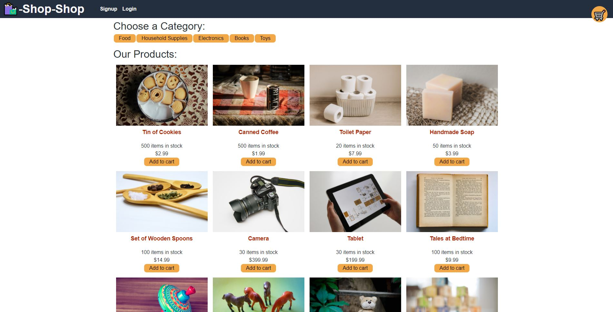
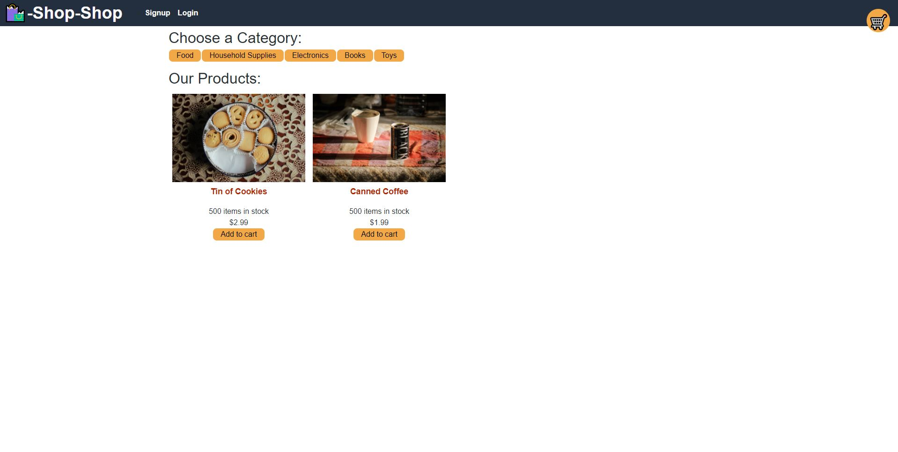
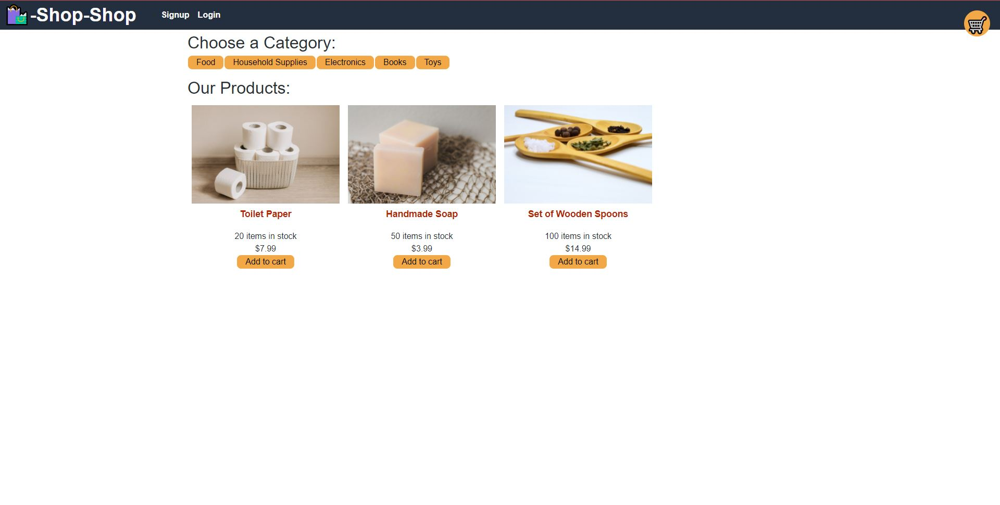
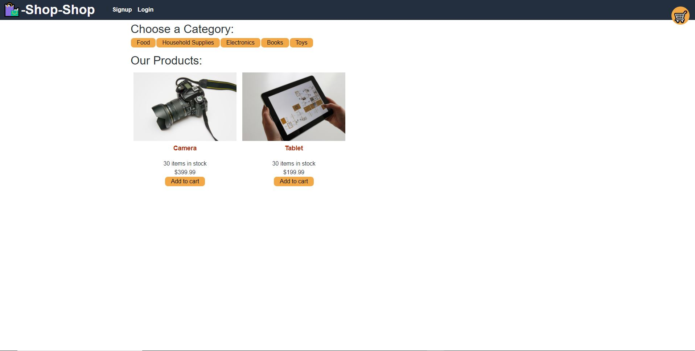
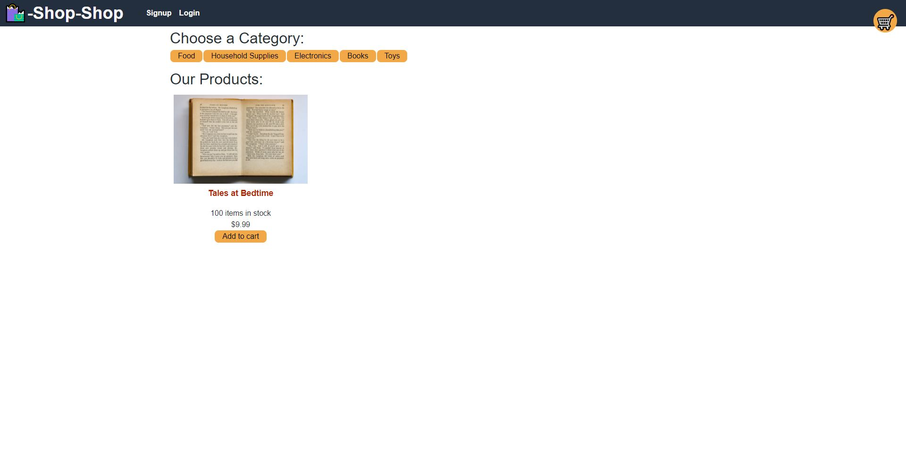
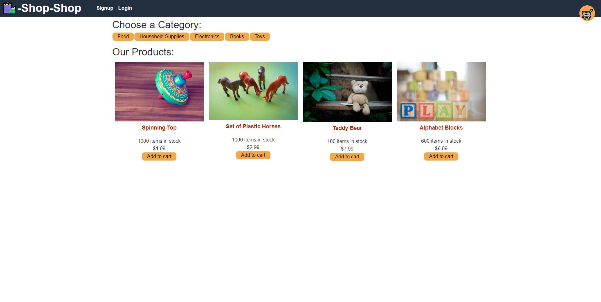
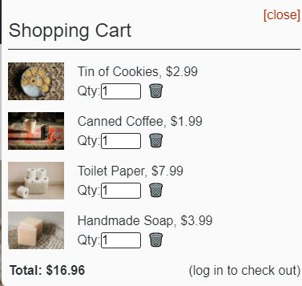

# redux-shopping

## Purpose
A Full stack Redux-Store with the following requirements:

AS a senior engineer working on an e-commerce platform
I WANT my platform to use Redux to manage global state instead of the Context API SO THAT my website's state management is taken out of the React ecosystem

## How the website looks and functions

## Built With
* Node.js
* MongoDB
* GraphQl Server
* React / Apollo Client/ Redux

## Contribution
Made with ❤️ by Killian Chamberlain

### Your Favorite Redux-Store

### Deployed Site

https://reduxshopping.herokuapp.com/

### Proof of Work

https://watch.screencastify.com/v/IfzWSPSZOwtv6tGfWXFI
